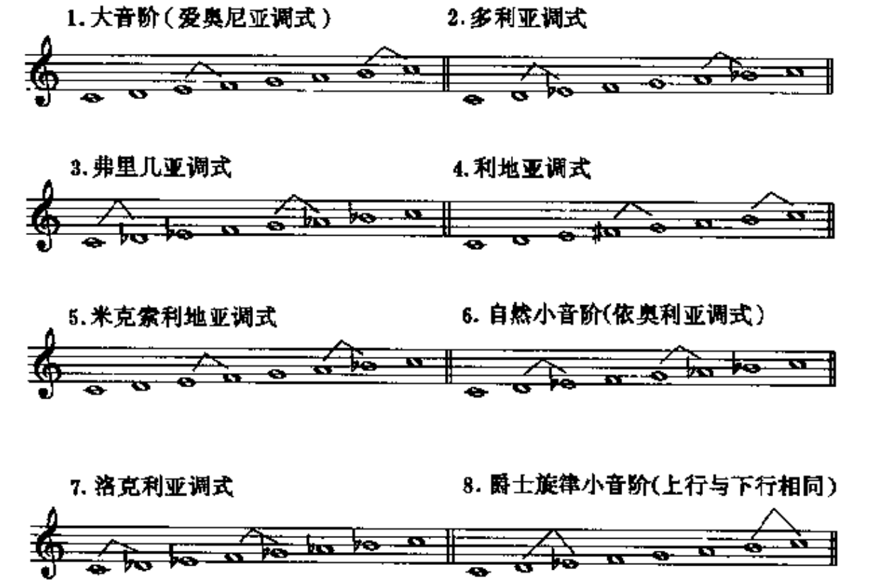
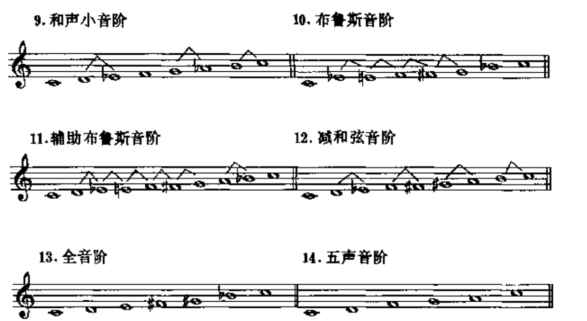
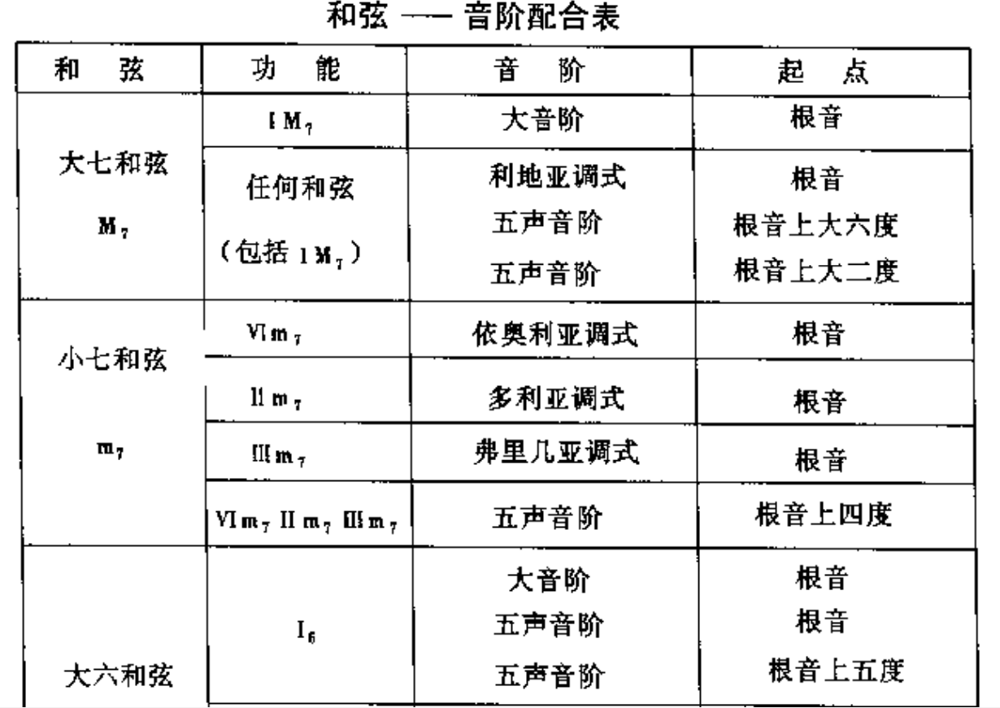
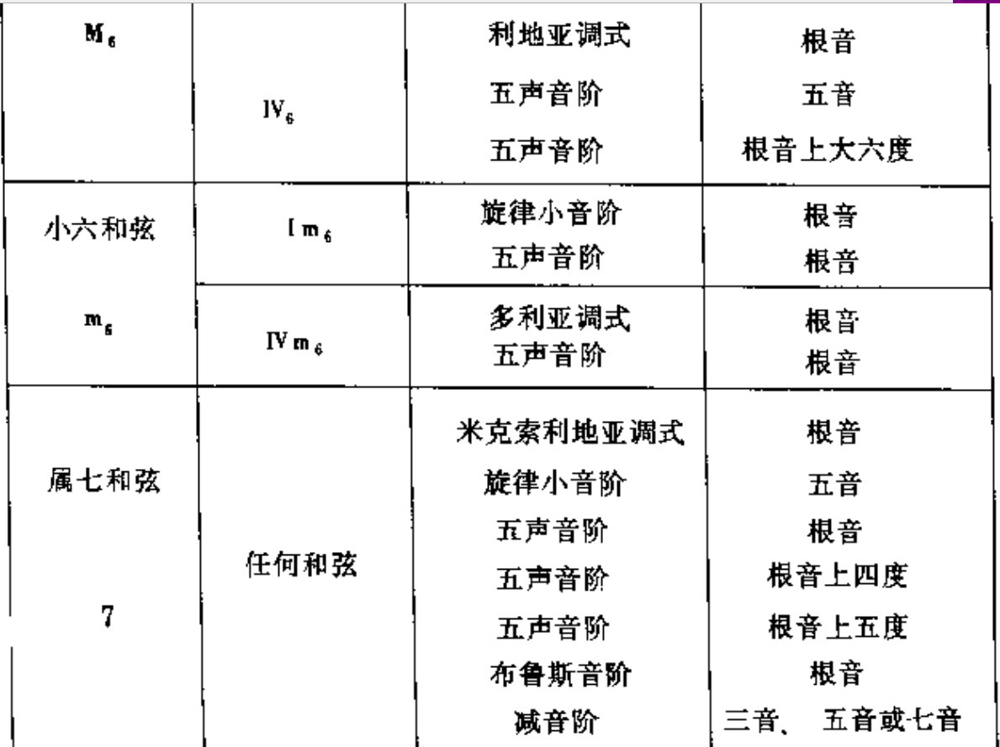
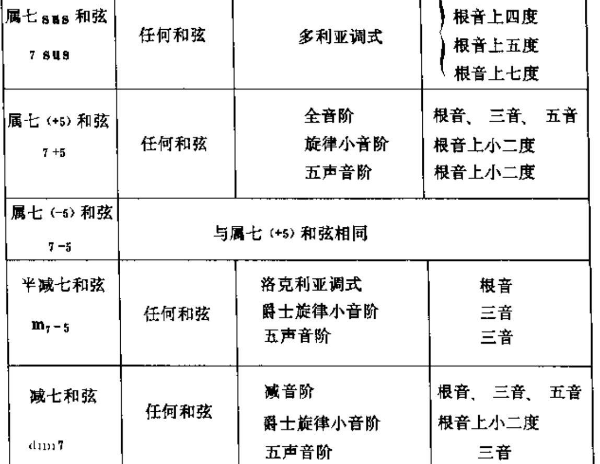
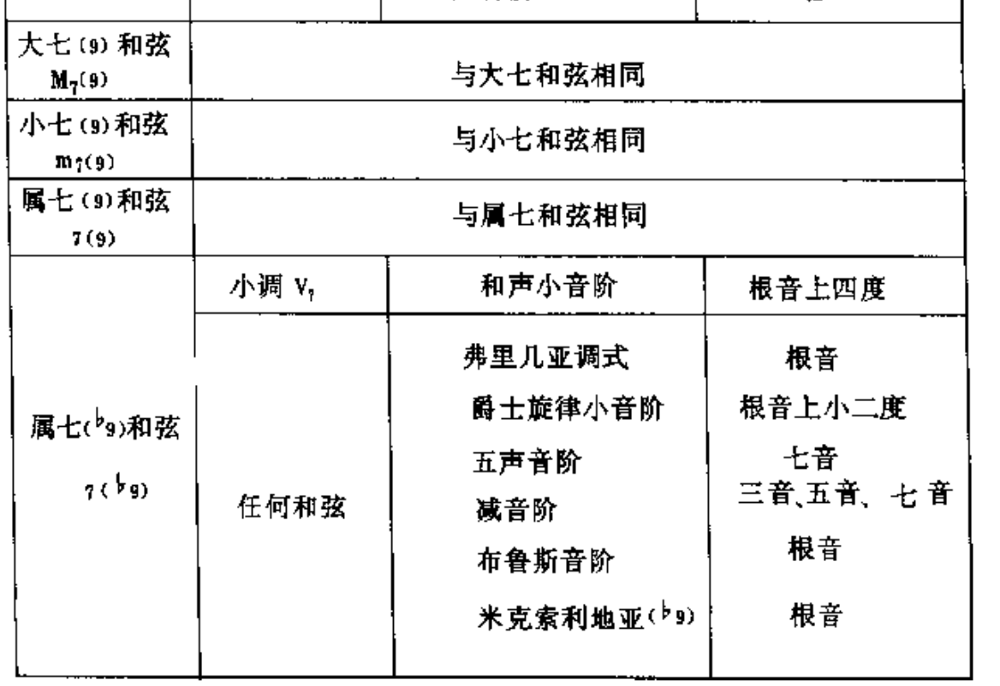
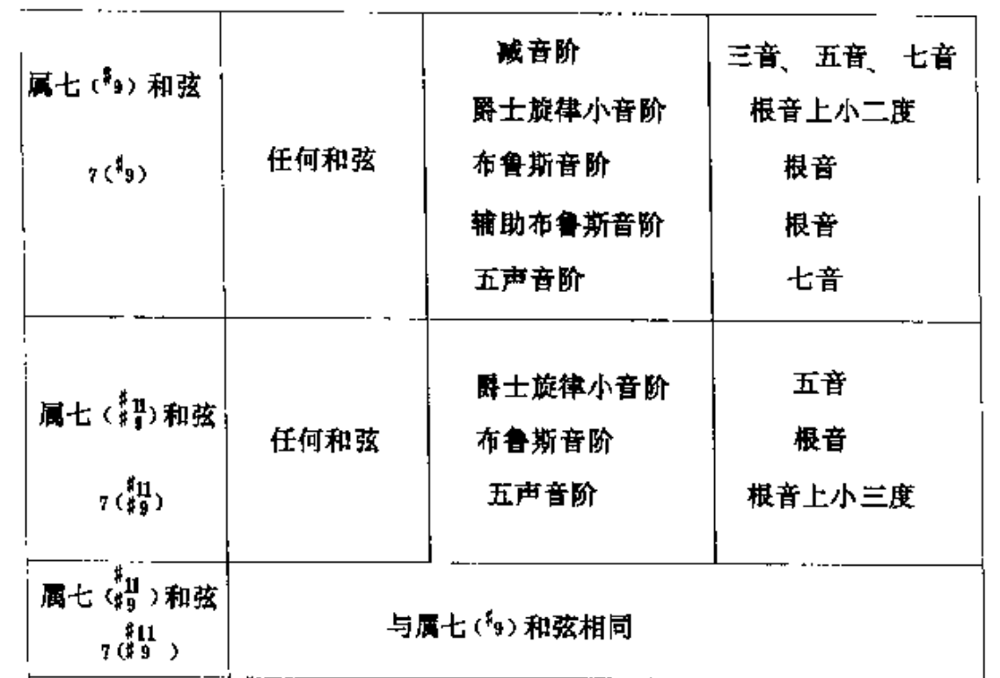
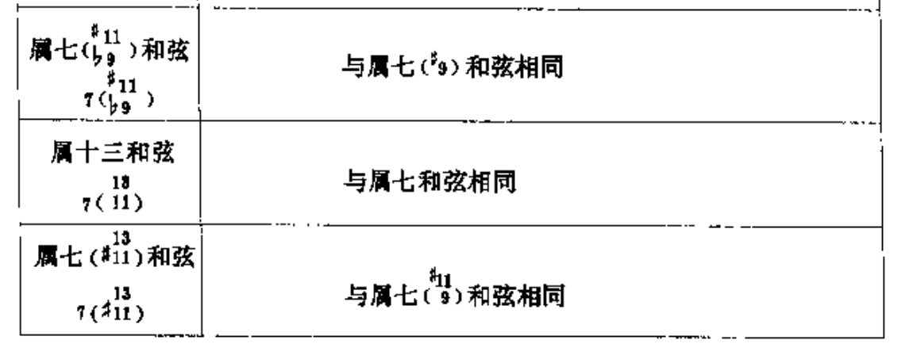

# 第五章 音阶与旋律

## 爵士音阶

爵士乐的和声在本质上是功能性的，爵士乐的旋律主要由大调音阶和小调音阶构成。
但是，爵士乐也经常使用其他的特色音阶。

爵士乐里能用到的音阶多达二十余种。从实践中看，用得最为普遍的有以下十余种。在下例音阶中，两音之间有“^”记号的为半音关系：

在上面列出的十四种音阶里，前十种为七声音阶，其余四种音阶声数不等；辅助布鲁斯音阶为九声，减和弦音阶为八声，全音阶为六声，五声音阶为五声。

## 和弦功能音阶

和弦功能音阶，简称为功能音阶，是指以和弦的功能和结构为基础而产生的音阶。
和弦音是构成音阶的骨干音阶，是不变的成分；和弦外音时构成和弦音阶的次要音阶，是相对可变的成分。

## 和弦-音阶配合表

下面的图表归纳了二十余种常用和弦以及能与它们配合的和弦音阶。

## 和弦外音与延伸音

在爵士乐中，和弦音与和弦外音之间并不泾渭分明，原因在于爵士乐的和弦结构有很大的伸缩性。
九和弦结构而言，最简单的可以是三和弦或七和弦，较复杂的可以是九和弦或十三和弦。
如果按延伸音理论看，所有和弦外音都有可能成为延伸音。

“核心音级”，“游移音级”

和弦音阶中的游移音级具有双重功能，它既可以作为和弦外音，也可以作为延伸音。
当游移音级在旋律中或某一声部中的时值较短(而且级进运动)时，它所体现的功能是和弦外音；
当游移音级在旋律中或某一声部中的时值较长、地位较突出时，它在和弦中便形成延伸音的功能。

## 旋律构成

音阶、节奏或音型

## 用变化音装饰旋律

在制作旋律时，不仅可以选择一定的和弦音阶，和弦音阶以外的音————即变化半音也可以用来装饰旋律。
变化音的使用方式有三种：

- 倚音用法：作为倚音，变化音总是出现在强节奏位置
- 助音：助音总是插在两个重复的音符之间。
- 经过音： 它出现在大二度音程之间

## 旋律的节奏

摇摆爵士乐的节奏特色主要体现在八分音符的运动方式上。

- 记谱与演奏
- 重音的位置，它不是在落拍而是在起拍上(即弱节奏位置)